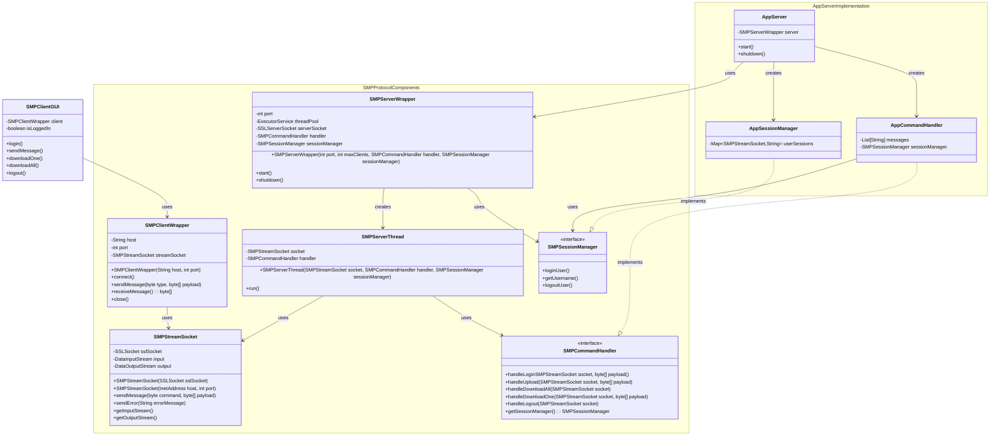

# Simple Messaging Protocol (SMP)

## Running the Application

### Compilation
```sh
# Create bin directory
mkdir -p bin

# Compile protocol classes first
javac -d bin protocol/*.java

# Compile client and server with protocol classes in classpath
javac -cp bin -d bin client/*.java
javac -cp bin -d bin server/*.java
```

### Running the Server
```sh
java -cp bin -Djavax.net.ssl.keyStore=smpkeystore.jks -Djavax.net.ssl.keyStorePassword=smppassword server.AppServer
```

### Running the Client
```bash
java -cp bin -Djavax.net.ssl.trustStore=smpkeystore.jks -Djavax.net.ssl.trustStorePassword=smppassword client.SMPClientGUI
```

## Class Diagram

